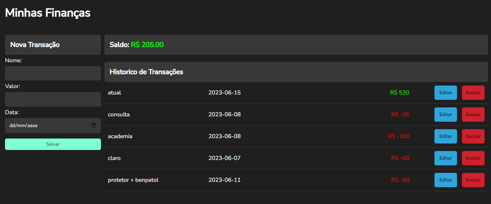

<h1 align="center">
   
   <p>A finance calculator 💸</p>
</h1>

## About 🔍

This is a project where we can carry out the financial management of our money

## Tools 🔨

 - [JavaScript](https://developer.mozilla.org/pt-BR/docs/Web/JavaScript)
 - [Sass](https://sass-lang.com)
 - [Babel](https://babeljs.io)
 - [Json-Server](https://github.com/typicode/json-server)

 # How Contribute ♻

 ```bash
   # Clone the Project
   $ git clone https://github.com/Guihenrique62/portfolio.git
 ```

 ```bash
   # Enter Directory
   $ cd portfolio
 ```
 ```bash
   # Make the server available on port 3000
   $ npm run json-server
 ```

## License 🧾

This project is under the MIT License. See the file License for more details.